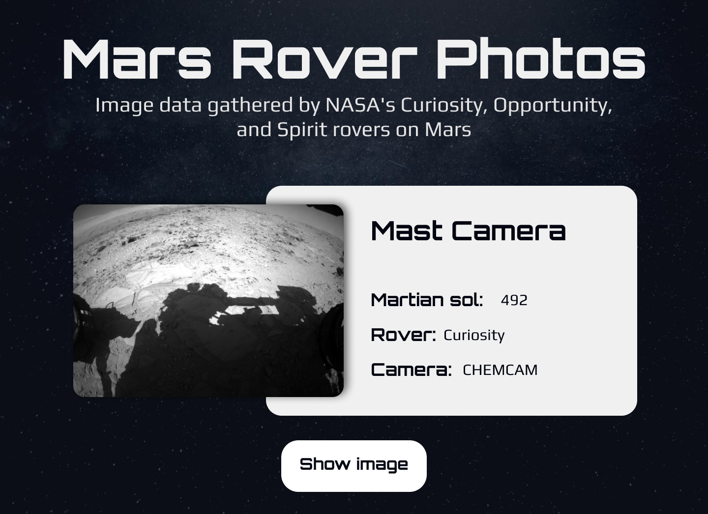

# mars-rover-photos
"Mars Rover Photos" is an exciting and educational project that utilizes HTML, Pug, CSS, Sass, and JavaScript to access the NASA API, retrieve random images from the Curiosity, Opportunity, and Spirit rovers, and present them on an attractive and interactive website. Each visit to the project offers a unique experience by displaying different images on each load, providing a stunning glimpse into space exploration.

## Table of content
- [Overview](#overview)
  - [Screenshot](#screenshot)
  - [Links](#links)
- [My process](#my-process)
- [Built with](#built-with)
-[Author](#author)
### Screenshot

### Links

- Live Site URL: [Mars Rover Photos](https://ifdotcom.github.io/mars-rover-photos/html/home.html)

## My process

### Built with

- Pug
- SASS

## Author

- GitHub - [ifdotcom](https://github.com/ifdotcom)
- Behance - [ifdotcom](https://www.behance.net/ifvidal)
- LinkedIn - [ifdotcom](https://www.linkedin.com/in/if-vidal/)
